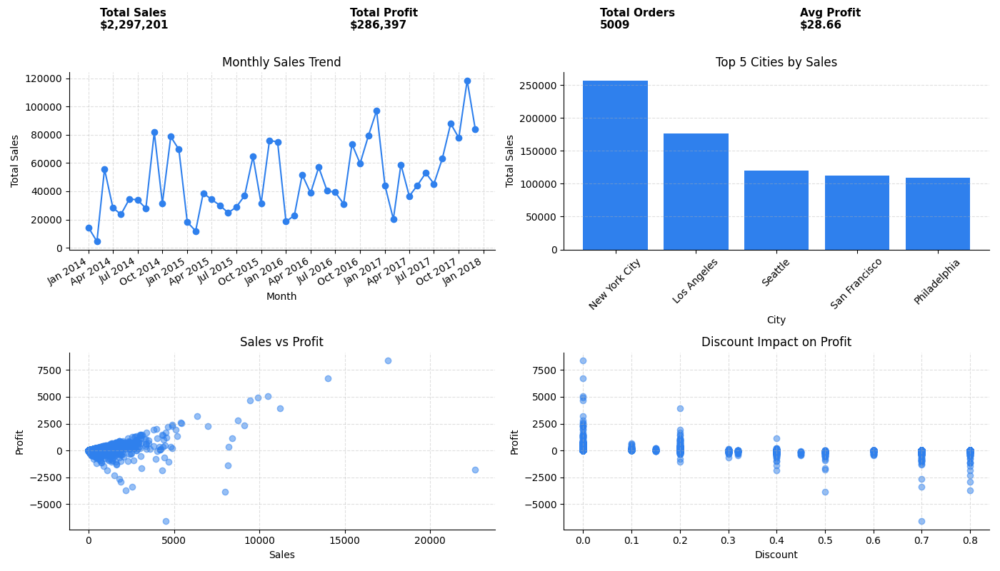

# 📊 Sales Data Analysis Dashboard

## 📌 Project Overview
This project analyzes sales data and presents key business insights through a visual dashboard built using Python.  
The goal is to transform raw data into meaningful information that supports decision-making.

---

## ⚙️ Tools & Technologies
- Python
- Pandas
- Matplotlib

---

## 📊 Dashboard Preview

---

## 📈 Key Insights
- Sales show an increasing trend over time  
- Not all high sales generate high profit  
- Discounts have a significant impact on profitability  

---

## 📂 Project Structure
